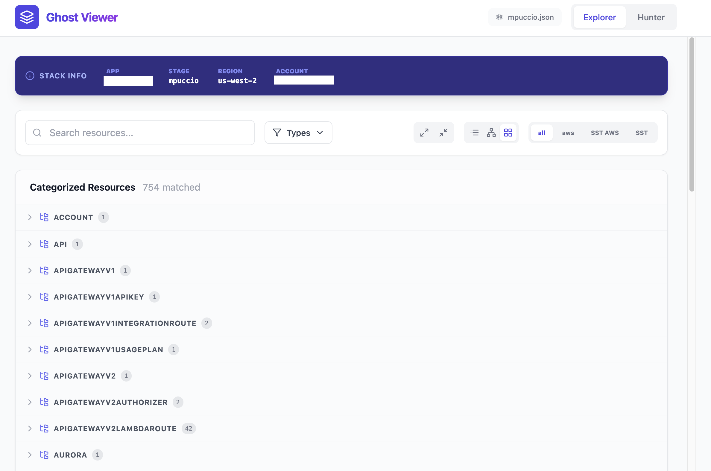
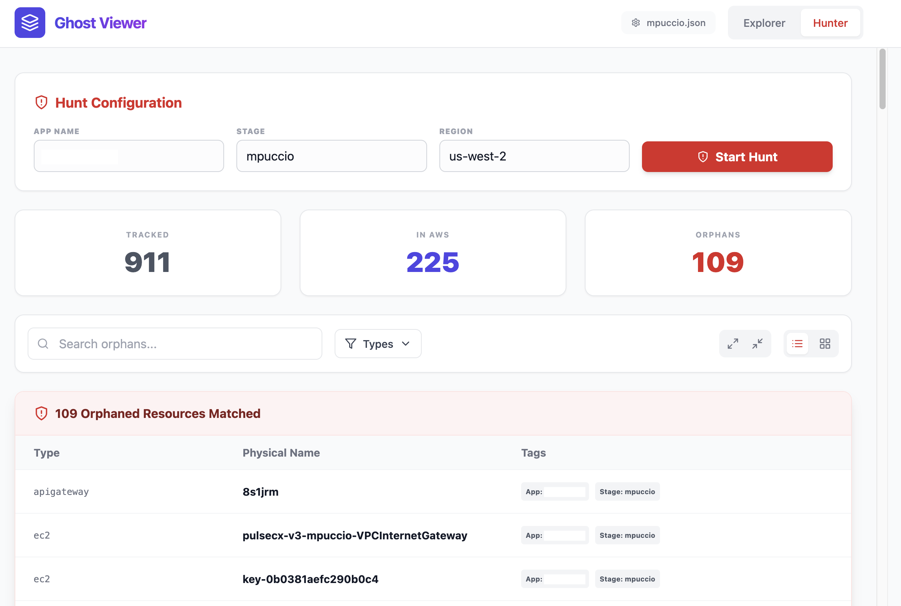

# Ghost Viewer 👻

**Ghost Viewer** is a specialized tool designed to visualize your [SST (Serverless Stack)](https://sst.dev/) state and "hunt" for orphaned resources in your AWS account. It provides a modern web interface to explore your local state file and compare it against live AWS resources to identify items that may have been left behind after deployments or manual removals.




Built for both **SST v2 (Pulumi-based)** and **SST v3 (Ion)**.

---

## 🚀 Quick Start

Run it directly in your SST project root:

```bash
npx @_mustachio/ghost-viewer
```

This will:
1. Auto-detect your SST state file (supporting Ion's `.sst/state.json` and v2's Pulumi stacks).
2. Start a local server on port 3001.
3. Open your browser to the Ghost Viewer dashboard.

### 🛠 Manual Configuration
If Ghost Viewer cannot auto-detect your state file, or if you want to view a specific state file from another directory:
- Click the **Settings (gear icon)** in the top right of the dashboard.
- Enter the absolute or relative path to your `state.json` or `.json` Pulumi stack file.
- Click the checkmark to save and reload.

---

## 🔐 Prerequisites & Permissions

Ghost Viewer uses your local AWS configuration to scan for resources. 

- **AWS Credentials**: Ensure your terminal session has active AWS credentials (e.g., run `aws sso login` or export your keys).
- **Permissions**: The user/role must have `tag:GetResources` permissions to perform the Ghost Hunt.

---

## ✨ Key Features

### 🔍 State Explorer
Visualize your `state.json` or Pulumi stack file in a searchable, categorized tree or flat list view.
- **Deep Linking**: One-click navigation to the AWS Console for almost any resource (Lambda, S3, DynamoDB, API Gateway, EC2, VPC, etc.).
- **Smart Filtering**: Filter by source (AWS vs SST) or specific resource types.
- **Metadata Inspection**: View the full outputs and metadata for every resource managed by your stack.

### 🏹 Ghost Hunter
Scan your live AWS account for resources tagged with your SST app and stage to identify "orphans"—resources that exist in AWS but are no longer tracked in your local state.
- **Grouped Views**: See orphans categorized by resource type.
- **Persistent Scans**: Scan results stay active as you navigate the app.
- **Wide Coverage**: Detects orphans across a wide range of AWS services.

### 🛠 CLI First
Designed to be zero-config. It automatically resolves your app name, stage, and region by parsing `.sst/stage`, `sst.config.ts`, or your Pulumi environment.

---

## 🛠 Tech Stack

- **Frontend**: React (Vite), Tailwind CSS, Lucide React, Fuse.js.
- **Backend**: Node.js (Express), AWS SDK v3.
- **Bundling**: `tsup` for the CLI, `vite` for the UI.

---

## 💻 Local Development

If you want to contribute or run Ghost Viewer from source:

1. **Clone the repo**:
   ```bash
   git clone https://github.com/the-human-mustachio/ghost-viewer.git
   cd ghost-viewer
   ```

2. **Install dependencies**:
   ```bash
   npm install
   ```

3. **Run in development mode**:
   ```bash
   npm run dev
   ```
   This starts the Vite frontend (port 5173) and the Express backend (port 3001) concurrently with hot-reloading.

4. **Build the project**:
   ```bash
   npm run build
   ```

---

## 📄 License

MIT © [Matt Puccio](https://github.com/the-human-mustachio)
